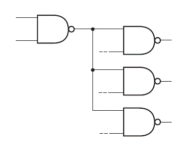
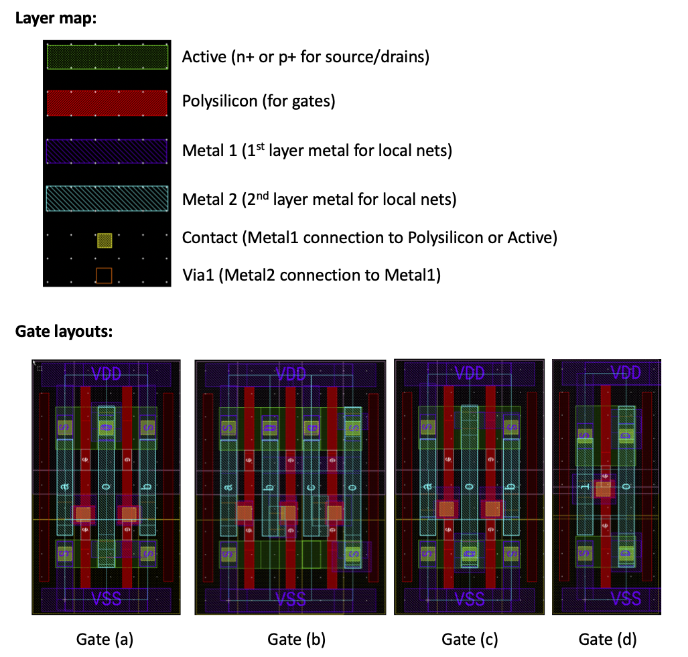

<h1 style="text-align: center;">
Lab 2: Spice Simulation of Standard Cell Propagation Delays
</h1>

Prof. Daniel Van Blerkom

Department of Electrical and Computer Engineering, Cal Poly Pomona

## Overview

You will be simulating the propagation delay of several Skywater standard cells, under different scenarios of output capacitive loading, fanout, and temperature.  From the simulation results, you will determine coefficients to predict the propagation delay of the standard cell for any capacitive loading and fanout.  This is the same approach that is used by the digital synthesis and place and route tools to predict the speed of a digital circuit; except the equations used are more complicated and include additional effects.

You might ask, why don't the digital tools just use analog simulation to determine the delays, instead of using an equation to fit the data.  The reason is that analog simulation takes much too long for a large circuit.  The digital tools need a quick way to find the propagation delays, that doesn't involve an analog simulation.

The SPICE simulation you will do is of a ring-oscillator.  A ring-oscillator consists of an odd number of inverting gates, connected in a ring.  See the figure of the three-stage ring oscillator below.  This circuit oscillates as follows:

 1. A 0 at the input turns into a 1 at the output after three rising gate delays
 2. The 1 is fed back to the input
 3. The 1 at the input turns into a 0 at the output after three falling gate delays
 4. The 0 is fed back to the input, and the cycle continues from the beginning.

The period of the oscillation is related to the delay through the stages and the number of stages N, as follows:
$$Period = N(t_{pd,rise}+t_{pd,fall})$$

The ring oscillator in the simulations you will run consists of 11 stages.  Each stage consists of one of the standard cells we are measuring, along with the capacitive loading and the fanout loading.  Note that we need to make the gates we are testing act like inverters by setting the other gate inputs to the right voltage.  This is explained more later.

### Fanout
In most digital circuits, a single gate's output will be connected to many inputs on many other gates in the design.  Every input presents a capacitive load to the output driving it.  Fanout is a measure of how many gates are driven by an output; for example, if a NAND gate has a fanout of 3, as shown below, it means that it's output is driving 3 other inputs.  Since high fanout means higher capacitance, the switching speed will get slower.  Managing fanout and maintaining the required logic speed is a critical task of the digital tools.

From our simulations of the propagation delays with different fanouts, you will be able to find the capacitance of each fanout load, $C_{input}$.

### Propagation delay equation

Our simplified equation for the propagation delay will be:
$$t_{pd,rise} = t_{0,rise} + K_{rise} (C_{par}+FC_{input})$$
and
$$t_{pd,fall} = t_{0,fall} + K_{fall} (C_{par}+FC_{input})$$

Where $t_0$ is the intrinsic delay, $C_{par}$ is the parasitic capacitance (due to the wiring), F is the fanout, $C_{input}$ is the input capacitance of the fanout loads, and K is in (psec/fF) and measures the increase is delay per fF of loading.

Note that the values will be different depending on if the output is rising or falling.

## Procedure

### Clone the assignment from GitHub
Just like you did for Lab 1, you will accept the assignment on GitHub Classroom, then use "git clone" to copy the files to your HPC account.

Make sure you are in your home directory before you use "git clone" - you can do this by typing

	cd
by itself; if you don't indicate a directory to change into, cd will put you in your home directory.  Then type

	git clone ssh://git@ssh.github.com:443/dvb-ece-cpp/lab-2-(your github id).git

If everything works, you should have a new directory called "lab-2-(your github id)".  cd into that directory to do the simulations.

### The Skywater Standard Cells

The Skywater standard cell SPICE circuits are found in this file:

	/data02/ECE4203/share/pdk/sky130A/libs.ref/sky130_fd_sc_hd/spice/sky130_fd_sc_hd.spice

You can look through this file to see all of the cells.  Each one is defined as a SPICE Subcircuit.
To get a quick list of all of them, you can use your new "grep" skills to print just the lines that have "subckt" in them:

	grep "subckt" /data02/ECE4203/share/pdk/sky130A/libs.ref/sky130_fd_sc_hd/spice/sky130_fd_sc_hd.spice

And, if you want to find just the nand gates, you could use

	grep "subckt.*nand" /data02/ECE4203/share/pdk/sky130A/libs.ref/sky130_fd_sc_hd/spice/sky130_fd_sc_hd.spice

The standard cell names have two numbers in them.  The first number indicates the number of inputs, and the second number indicates the strength of the drive for the gate.  For example, the nand2_4 gate has two inputs, and has a drive strength of x4.  Higher drive strength means the gate can switch the load capacitance faster than a smaller drive strength.  Physically, the width of the transistors are multiplied by the drive strength factor.

### Running the SPICE simulations with the Makefile

Take a look at the Makefile; you learned about Makefiles in Lab 1.  Here, the Makefile will run "sed" to do some text substitutions in a master SPICE Simulation file called "tpd_test_template.cir", and create a new file "tpd_test.cir".  After running "sed", the Makefile will run **ngspice** on "tpd_test.cir", which will simulate the circuit.

Try running the simulation with the default values by typing

	make run

To exit **ngspice** after it finishes running, just type "quit".  Notice the simulation reports measured values for the rising and falling propagation delays.

There are four parameters that you can change, to find the delay of different gates in different loading and environmental conditions.  The five parameters are:
|Name |Description   |
|--|--|
|cell  | name of the standard cell (i.e. nand2_2)  |
|cell_inputs | what the inputs of the cell should be tied to (explained below) |
|cpar | the capacitive loading on each stage (for example, 10f means 10fF) |
|fanout | the fanout loading on each stage (from 1 to 6) |
|temp | the temperature for the simulation (in Celsius) |

So, to run a simulation on the nand2_4, with 5fF of loading and a fanout of 3, at 125C, we would type:

	make run cell=nand2_4 cell_inputs="in pull_up" cpar=5f fanout=3 temp=125

### The cell_inputs parameter

The cell_inputs parameter is a string that lists how the inputs to each stage of the ring-oscillator are connected.  For a two input gate, there will be two inputs; for a three input gate, there would three inputs, etc.  The valid input values are "in", "pull_up" or "pull_down".

You should connect "in"  to only one input, and the rest should be either "pull-up" or "pull-down".  The goal is to make the gate being tested act like an inverter, so that the ring-oscillator will oscillate.  For a NAND gate, it will only act like an inverter if all of the other inputs are high; therefore, all the other inputs should be set to "pull_up".  A NOR gate only acts like an inverter if all of the other inputs are low; therefore, all the other inputs should be set to "pull_down".

|Gate | cell_input values (in connected to first input) |
|--|--|
|2-input NAND gate| "in pull_up" |
|3-input NAND gate| "in pull_up pull_up" |
|4-input NAND gate| "in pull_up pull_up pull_up" |
|2-input NOR gate| "in pull_down" |
|3-input NOR gate| "in pull_down pull_down" |
|4-input NOR gate| "in pull_down pull_down pull_down" |

You will need to figure out for yourself the correct value to use for cell_input for the XOR gate, to make it act like an inverter.

### Simluation results

Run simulations for six standard cells:

 1. nand2_2
 2. nand2_8
 3. nor2_2
 4. nor4_2 (note, it has four inputs)
 5. xor2_2
 6. your choice (make sure it will act as an inverter, i.e. you can't choose an AND or OR gate!)

Find the values for $t_{pd,rise}$ and $t_{pd,fall}$ for the following conditions:

 1. Three values of cpar:  1f, 5f and 30f (keep fanout=1)
 2. Three values of fanout: 1, 2 and 6 (keep cpar=1f)

Do all of these simulations at a temperature of 27 C. 

**IN ADDITION**, For the nand2_2 only, also do the above simulations at a temperature of 125 C.

Tabulate the results in Excel.

For each of the gates and at the different temperatures for the nand2_2, determine the value of $K_{rise}$ and $K_{fall}$ in psec/fF, by finding the slope over the values of cpar.

Now, find the slope of the delay over the three values of fanout; this will be in units of psec/fanout.
Then, divide this result by the value of K you found above, to determine the value of $C_{input}$, the capacitance of the each fanout input.

Finally, find the value of $t_{0,rise}$ and $t_{0,fall}$ by plugging all the values you found into the propagation delay equation for one of the measurements and solving for it.

### Example

Here's an example for the nand2_2 at a temperature of -40C:

The five simulations:

	make run cell=nand2_2 cell_inputs="in pull_up" cpar=1f fanout=1 temp=-40
	make run cell=nand2_2 cell_inputs="in pull_up" cpar=5f fanout=1 temp=-40
	make run cell=nand2_2 cell_inputs="in pull_up" cpar=30f fanout=1 temp=-40
	make run cell=nand2_2 cell_inputs="in pull_up" cpar=1f fanout=2 temp=-40
	make run cell=nand2_2 cell_inputs="in pull_up" cpar=1f fanout=6 temp=-40

| Measurement #| cpar | fanout | $t_{pd,rise}$ | $t_{pd,fall}$ | 
|--|--|--|--|--|
| 1 | 1f | 1 | 43.5 psec | 29.0 psec |
| 2 | 5f | 1 | 65.5 psec | 44.6 psec |
| 3 | 30f | 1 | 202.5 psec | 142.5 psec |
| 4 | 1f | 2 | 67.0 psec | 44.8 psec |
| 5 | 1f | 6 | 165.4 psec | 110.0 psec |
	
Using measurements 1,2 and 3, and using the SLOPE function in Excel, we find:
$K_{rise}$ = 5.48 psec/fF
and
$K_{fall}$ = 3.91 psec/fF

Using measurement 1,4, and 5, in a similar fashion, and dividing the slope found by the value of K, we find:
$C_{input,rise}$ = 4.46 fF
and
$C_{input,fall}$ = 4.15 fF
Note that we would expect the values to be the approximately the same, and in fact they are very close.

Finally, putting these values in to the propagation delay equations above, and using measurement 1, we can solve for $t_0$:
$t_{0,rise}$ = 13.57 psec
and
$t_{0,fall}$ = 8.86 psec

## Additional Questions

 1. Even though the nand2_8 has a much higher drive strength than the nand2_2, why is the ring-oscillator frequency almost the same for both of them.
 2. Why do you think $K_{rise}$ is generally always larger than $K_{fall}$.
 3. Why does the nor2_2 gate have higher $K_{rise}$ than the nand2_2 gate?
 4. Which is faster, a single nor4_2 gate, or a 4-input NOR created out of three nor2_2, and a nand2_2, as shown below?

> Written with [StackEdit](https://stackedit.io/).

